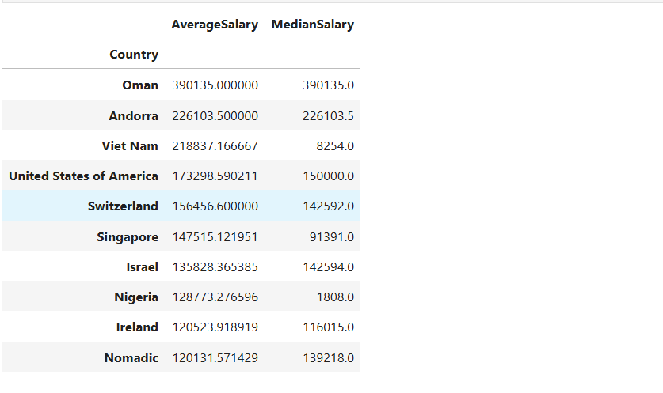

# Stack Overflow Developer Survey — EDA

Дослідницький аналіз великого датасету (49 000+ респондентів)  
з результатами опитування розробників Stack Overflow.

## Що зроблено
- Аналіз повноти даних, робота з пропущеними значеннями, інтерсекція множин
- Розрахунок мір центральної тенденції (mean, median, mode) для досвіду роботи
- Групування по країнах та вікових категоріях, розрахунок медіанної компенсації Python-розробників
- Перцентильний аналіз зарплат, багатокритеріальна фільтрація

## Технології
Python · Pandas · NumPy · Jupyter Notebook

## Датасет
[Stack Overflow Developer Survey 2023](https://survey.stackoverflow.co/2023/) — публічний датасет,  
49 000+ респондентів з усього світу.

## Результат

